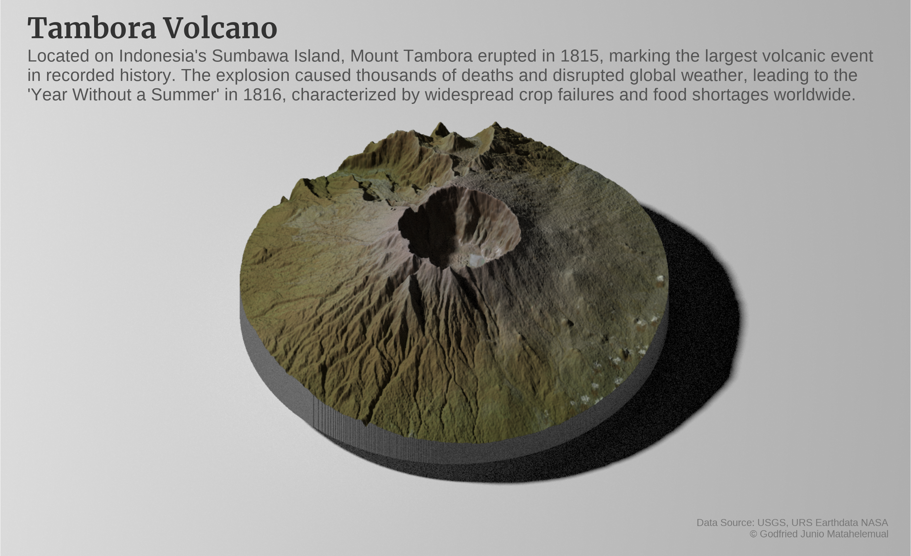

# 30DayMapChallenge 🗺️

Welcome to my contributions to the 2024 #30DayMapChallenge!

This challenge is a great opportunity to enhance my spatial data visualization skills by creating and sharing maps based on daily themes throughout November. My focus will revolve around three areas I am passionate about: climate, energy, and sustainability. Each map will reflect creative approaches and various mapping techniques using tools like QGIS, Python, and R.

I will update this repository with my code, workflows, and insights gathered throughout the challenge.

| Tool         | Usage Count |
|--------------|-------------|
| Python       | 7           |
| R            | 5           |
| ArcGIS       | 4           |
| Tableau      | 3           |
| Google Earth Engine | 1    |
| DALL-E       | 1           |

## 1. Points

**EV Charging stations**  
Mapping the distribution of EV charging stations across NYC to analyze accessibility. This visualization helps identify charging deserts and potential areas for new installations.

## 2. Lines

**Kalimantan River Network**  
I have always been fascinated by the intricate river systems that sustain life and connect remote areas. This map meticulously traces the river networks of Kalimantan using HydroSheds by Spatial Thoughts. Rivers of the same color indicate those that originate from a common main river.

## 3. Polygons

**Bivariate Map of Energy Use Intensity and Water Use Intensity in NYC**  
Understanding the relationship between energy and water consumption is crucial for sustainable urban planning. I created this bivariate map to visualize how these two essential resources are utilized across NYC neighborhoods. By combining energy use intensity and water use intensity, this map helps to identify areas where conservation efforts can be optimized and where infrastructure improvements might be needed.

## 4. Hexagons

**Hex map of NYC Trees**  
A hexagonal grid representation of NYC blob distribution using data from NYC Open Data.

## 5. A Journey

**Climate Migration patterns in the U.S**  
As climate change increasingly influences migration patterns, I wanted to explore its impact across the U.S. This map visualizes migration trends influenced by climate events, offering insights into how communities are adapting to environmental changes.

## 6. Raster

**South Sumatra Forest Loss**  
Having seen the alarming deforestation rates in South Sumatra, I wanted to shed light on this pressing issue. Using  data from Hansen/UMD/Google/USGS/NASA, this map highlights deforestation patterns and serves as a call to action for sustainable land management.

## 7. Vintage Style

**Indonesia Ring of Fire**  
Indonesia’s volcanic activity has always intrigued me, and I wanted to present it in a vintage cartographic style. This map captures the seismic activity of the region while paying homage to classic cartography techniques.

## 8. Humanitarian Data Exchange (HDX)

**California Fire**  
Mapping wildfire impacts across California using HDX data.

## 9. AI Only

**Public transport connecting all NP**  
Exploring AI-driven solutions for public transport connectivity across national parks.

## 10. Pen & Paper

**Country with Major Cities**  
A hand-drawn map visualizing major cities of a chosen country.

## 11. Arctic

**Map Arctic ice extent changes over time**  
For day 11, I created an animated map showcasing the changes in Arctic ice extent from 1980 to 2020 at 10-year intervals. Inspired by [John Nelson's cartographic techniques](https://www.youtube.com/watch?v=iT4JOSUm7yE&t=286s), I aimed to visualize the changes of Arctic ice changes in a compelling and informative way.

## 12. Time and Space

**Land Cover Change Jabodetabek**  
Mapping urban expansion in Jabodetabek over time.

## 13. A New Tool

**3D Forest Height Maps with AerialOD**  
Exploring new 3D mapping tools for visualization.

## 14. A World Map

**World Temperature Anomaly 2024 vs 1900-2000**  
Using data from [Mapping global temperature changes over time.](https://data.giss.nasa.gov//gistemp/maps/), I tried to illustrate the stark reality of climate change by comparing global temperature anomalies between 2024 and the 1900-2000 baseline. 

## 15. My Data

**Grand canyon trekking**  
Mapping trekking routes and elevation changes in the Grand Canyon.

## 16. Choropleth

**Most threatening disaster in each county**  
A choropleth visualization highlighting disaster-prone areas across counties in the U.S.

## 17. Collaborative Map

**NYC Walkability Map**  
For the collaborative map, I created the NYC Walkability Index with Ismail Rashad. The Walkability Index is formed from five key indices: Land Use Diversity Index (LUDI), Intersection Density Index (IDI), Public Transportation Accessibility Index (PTAI), Population Density Index (PDI), and Normalized Difference Vegetation Index (NDVI). These indices leverage geospatial data to provide a comprehensive perspective on walkability and its impact on urban sustainability and overall livability.

## 18. 3D

**3D Tambora Volcano**  
I created a 3D visualization of Mount Tambora, one of Indonesia's most famous volcanoes, using topographic data derived from Digital Elevation Models (DEM) and Landsat satellite imagery. Inspired by Tyler Morgan-Wall's ([tutorial](https://www.tylermw.com/posts/data_visualization/a-step-by-step-guide-to-making-3d-maps-with-satellite-imagery-in-r.html)), this map highlights the caldera and surrounding terrain that shows insights into the volcano's structure and historical significance.

## 19. Typography

**Text-based Map of NY State Climate Action Council Scoping Plan**  
This word cloud visualizes key themes and priorities from the New York State Climate Action Council Scoping Plan 2022. Using a typographic approach, it highlights the most frequently mentioned terms, such as “program,” “support,” “community,” and “climate action,” reflecting the state’s focus on sustainability, emissions reduction, and community engagement. The varying font sizes represent the frequency of words in the document, providing insights into the policy’s emphasis on disadvantaged communities, energy efficiency, and greenhouse gas reductions.

## 20. OpenStreetMap

**Jakarta Circular Map**  
This minimalist circular map of Jakarta, the capital of Indonesia, showcases the city's road network, waterways, and green spaces using OpenStreetMap data. With subtle colors and precise lines, it offers a fresh, modern perspective on Jakarta’s urban layout, complemented by geographic coordinates for added context.

## 21. Conflict

**Orangutan vs deforestation**  
Seeing the impact of deforestation on orangutan habitats in Sumatra and Borneo inspired me to create this map using geospatial data and satellite imagery. It highlights the alarming overlap between critical habitats and deforestation activities such as palm oil plantations and logging. This visualization serves as a call to action for conservation efforts and sustainable land-use policies to protect these endangered primates and their rapidly disappearing forests.

## 22. Two Colours

**Jakarta Road Circular Map Black and White**  
For Day 22, I created this minimalist black-and-white circular map of Jakarta’s roads to showcase the city’s road network in a clean, modern style. Using data from OpenStreetMap (OSM) and tools in R, this map highlights the connectivity of Jakarta's roadways while maintaining a visually striking yet simple aesthetic.

## 23. Memory

**Where flood mitigation projects were implemented**  
Tracking locations where flood mitigation efforts took place.

## 24. Only Circular Shapes

**Manhattan Boundary Formed by a Circle**  
For Day 24, I experimented with creating a unique visualization of Manhattan's boundary using only circular shapes. This minimalist design reimagines the iconic shape of the borough through a series of evenly spaced circles.

## 25. Heat

**Jakarta Land Surface Temperature (LST) Over Time**  
For Day 25, I mapped Jakarta's land surface temperature using Landsat data processed in Google Earth Engine. The map presents the average temperature distribution for the periods 1999-2000, 2009-2010, and 2022-2023, highlighting urban heat phenonmenon effects over time. Warmer areas in red represent densely built regions, while cooler zones in blue indicate green spaces and water bodies.

## 26. Map Projections

**Copernicus Climate Data Visualization**  
Exploring different map projections for climate data.

## 27. Micromapping

**SCBD 3D (Kyle Walker)**  
Creating a detailed 3D micromap of SCBD.

## 28. The Blue Planet

**Mississippi River Relative Elevation Model (REM)**  
For Day 28 of Blue Planet, I chose to visualize a river. I explored the Mississippi River that crosses Arkansas using a Relative Elevation Model (REM) to visualize its topography and surrounding landscapes. This is my first time creating this kind of visualization, and I followed Daniel Jahn's ([notebook](https://github.com/DahnJ/REM-xarray)). It was challenging but fun to try!

## 29. Overture

**Jakarta 3D Buildings**  
Again, this is my first time using Overture data. I'm using R to create a 3D visualization of Jakarta, the capital of Indonesia. This project allowed me to explore the complexities of Jakarta's urban landscape, focusing on the SCBD (Sudirman Central Business District) area, one of the city's most prominent financial hubs. The visualization showcases Jakarta’s intricate skyline, with notable landmarks such as the National Monument (Monas) visible to the north of the CBD.  While I noticed that some high-rise buildings may be missing from the dataset, Overture provides a valuable resource for capturing building heights, particularly in Global South cities where such data can be scarce. Let’s wait for the next data update to see how it evolves!

## 30. The Final Map

**Compilations of where I finished the map**  
A summary visualization of all maps completed during the challenge.

## Contact

Feel free to connect with me:

- **Email:** [godfried@nyu.edu](mailto:godfried@nyu.edu)
- **LinkedIn:** [linkedin.com/in/juniomata](https://linkedin.com/in/juniomata)
- **Website:** [juniomata.github.io](https://juniomata.github.io)

